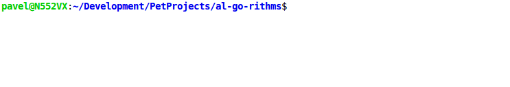
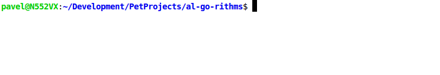
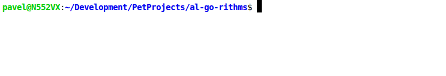
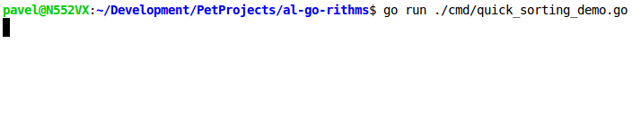

# Al[Go]rithms

Learning of algorithms and data structures in Go

 
    

## Sorting

### [Stupid](./internal/sorting/stupid.go)

  

    Demo
  

     
    

### [Bubble](./internal/sorting/bubble.go)

  

    Demo
  

     
    

### [Shaker](./internal/sorting/shaker.go)

  

    Demo
  

     
    

### [Comb](./internal/sorting/comb.go)

  

    Demo
  

     
    

### [Quick](./internal/sorting/quick.go)

  

    Demo
  

     
    

## License

